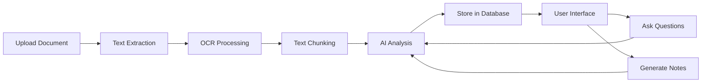

# 🧠 AI Smart Notebook

> **Intelligent AI-Powered Document Workspace**  
> Transform your documents into interactive knowledge sources with AI assistance

[](https://reactjs.org/)
[](https://fastapi.tiangolo.com/)
[](https://www.python.org/)
[](https://www.typescriptlang.org/)

---

## 📖 Table of Contents

- [What is AI Smart Notebook?](#what-is-ai-smart-notebook)
- [Key Features](#key-features)
- [How It Works](#how-it-works)
- [Technology Stack](#technology-stack)
- [Project Structure](#project-structure)
- [Installation Guide](#installation-guide)
- [Usage Examples](#usage-examples)
- [API Documentation](#api-documentation)
- [Use Cases](#use-cases)
- [Future Enhancements](#future-enhancements)
- [Contributing](#contributing)
- [License](#license)
- [Author](#author)

---

## 🎯 What is AI Smart Notebook?

**AI Smart Notebook** is a production-ready full-stack web application that revolutionizes how you interact with documents. Instead of passively reading PDFs, Word documents, or text files, you can now:

- **Upload** any document (PDF, DOCX, TXT, images with text)
- **Extract** text automatically using OCR (Optical Character Recognition)
- **Analyze** content with advanced AI models
- **Ask questions** and get intelligent, context-aware answers
- **Generate** automatic summaries and structured notes
- **Organize** everything in a beautiful notebook-style interface

Think of it as having an AI assistant that reads your documents, understands them deeply, and helps you learn faster.

---

## ✨ Key Features

### 📄 Document Processing
- **Multi-format Support**: Upload PDFs, DOCX, TXT, and image files (PNG, JPG)
- **OCR Technology**: Extract text from scanned documents and images automatically
- **Smart Text Extraction**: Preserves document structure and formatting
- **Batch Upload**: Process multiple documents at once

### 🤖 AI-Powered Intelligence
- **Automatic Summaries**: Get instant document summaries with key points
- **Question Answering**: Ask anything about your document in natural language
- **Context Awareness**: AI understands document context for accurate responses
- **Structured Notes**: Generate organized notes with headers, bullet points, and sections

### 📓 Notebook Workspace
- **Clean Interface**: Distraction-free, notebook-style design
- **Organized Notes**: Save and organize AI-generated notes by topic
- **Search Functionality**: Find information quickly across all notebooks
- **Persistent Storage**: All your work is saved securely in the database

### 🔧 Technical Excellence
- **Type-Safe Code**: Full TypeScript implementation for reliability
- **REST API**: Clean, documented backend API
- **Async Processing**: Fast, non-blocking document processing
- **Modular Architecture**: Easy to extend and maintain

---

## 🔄 How It Works



### Step-by-Step Process

1. **Upload**: User uploads a document through the web interface
2. **Extraction**: Backend extracts text content (using OCR for images/scanned PDFs)
3. **Preprocessing**: Text is cleaned and split into manageable chunks
4. **AI Processing**: Large Language Model analyzes document context
5. **Storage**: Document and metadata saved to MongoDB database
6. **Interaction**: User can now:
   - Ask questions about the document
   - Request summaries
   - Generate structured notes
   - Save important insights
7. **Response**: AI generates contextually relevant answers using document content
8. **Save**: All interactions and notes are stored for future reference

---

## 🛠️ Technology Stack

### Frontend Technologies
| Technology | Purpose | Version |
|------------|---------|---------|
| **React.js** | UI Framework | 18.x |
| **TypeScript** | Type Safety | 5.x |
| **Vite** | Build Tool | 4.x |
| **Tailwind CSS** | Styling | 3.x |
| **React Router** | Navigation | 6.x |
| **Axios** | HTTP Client | 1.x |

### Backend Technologies
| Technology | Purpose | Version |
|------------|---------|---------|
| **FastAPI** | Web Framework | 0.100+ |
| **Python** | Programming Language | 3.9+ |
| **Pydantic** | Data Validation | 2.x |
| **Uvicorn** | ASGI Server | Latest |

### AI & Processing
| Technology | Purpose |
|------------|---------|
| **OpenAI GPT** | Primary LLM (or Gemini/LLaMA) |
| **Tesseract OCR** | Image text extraction |
| **PyPDF2** | PDF text extraction |
| **python-docx** | DOCX processing |
| **Pillow** | Image processing |

### Database
| Technology | Purpose |
|------------|---------|
| **MongoDB** | Document Storage |
| **Motor** | Async MongoDB Driver |

---

## 📁 Project Structure

```
ai-smart-notebook/
│
├── frontend/                      # React Frontend Application
│   ├── src/
│   │   ├── components/           # Reusable UI Components
│   │   │   ├── DocumentUpload.tsx    # File upload component
│   │   │   ├── NotebookView.tsx      # Main notebook interface
│   │   │   ├── ChatInterface.tsx     # Q&A chat component
│   │   │   └── NoteEditor.tsx        # Note editing component
│   │   │
│   │   ├── pages/                # Page Components
│   │   │   ├── Home.tsx             # Landing page
│   │   │   ├── Dashboard.tsx        # User dashboard
│   │   │   └── NotebookPage.tsx     # Notebook workspace
│   │   │
│   │   ├── services/             # API Service Layer
│   │   │   ├── api.ts              # API configuration
│   │   │   ├── documentService.ts  # Document operations
│   │   │   └── aiService.ts        # AI interactions
│   │   │
│   │   ├── hooks/                # Custom React Hooks
│   │   │   ├── useDocument.ts      # Document state management
│   │   │   └── useAI.ts            # AI interaction hooks
│   │   │
│   │   ├── store/                # State Management
│   │   │   └── appStore.ts         # Global state (Zustand/Redux)
│   │   │
│   │   ├── types/                # TypeScript Type Definitions
│   │   │   ├── document.ts         # Document types
│   │   │   └── notebook.ts         # Notebook types
│   │   │
│   │   ├── App.tsx               # Root Component
│   │   └── main.tsx              # Application Entry Point
│   │
│   ├── public/                   # Static Assets
│   ├── index.html               # HTML Template
│   ├── tailwind.config.js       # Tailwind Configuration
│   ├── postcss.config.js        # PostCSS Configuration
│   ├── tsconfig.json            # TypeScript Configuration
│   ├── vite.config.ts           # Vite Configuration
│   └── package.json             # Frontend Dependencies
│
├── backend/                      # FastAPI Backend Application
│   ├── app/
│   │   ├── api/                 # API Routes
│   │   │   ├── documents.py        # Document endpoints
│   │   │   ├── notebooks.py        # Notebook endpoints
│   │   │   └── ai.py              # AI endpoints
│   │   │
│   │   ├── services/            # Business Logic
│   │   │   ├── document_service.py  # Document processing
│   │   │   ├── ocr_service.py      # OCR operations
│   │   │   ├── ai_service.py       # AI integration
│   │   │   └── text_processor.py   # Text chunking/preprocessing
│   │   │
│   │   ├── models/              # Database Models
│   │   │   ├── document.py         # Document model
│   │   │   └── notebook.py         # Notebook model
│   │   │
│   │   ├── schemas/             # Pydantic Schemas
│   │   │   ├── document.py         # Document schemas
│   │   │   └── ai.py              # AI request/response schemas
│   │   │
│   │   ├── core/                # Core Configuration
│   │   │   ├── config.py           # App settings
│   │   │   └── database.py         # Database connection
│   │   │
│   │   └── main.py              # FastAPI Application Entry
│   │
│   ├── requirements.txt         # Python Dependencies
│   └── .env.example            # Environment Variables Template
│
├── .gitignore                   # Git Ignore Rules
└── README.md                    # This File

```

---

## 🚀 Installation Guide

### Prerequisites

Before you begin, ensure you have the following installed:

- **Node.js** (v16 or higher) - [Download](https://nodejs.org/)
- **Python** (v3.9 or higher) - [Download](https://www.python.org/)
- **MongoDB** (v5.0 or higher) - [Download](https://www.mongodb.com/) or use MongoDB Atlas
- **Git** - [Download](https://git-scm.com/)

### Step 1: Clone the Repository

```bash
git clone https://github.com/khushalkumarsahu/ai-smart-notebook.git
cd ai-smart-notebook
```

### Step 2: Backend Setup

#### 2.1 Navigate to Backend Directory
```bash
cd backend
```

#### 2.2 Create Virtual Environment
```bash
# Windows
python -m venv venv
venv\Scripts\activate

# macOS/Linux
python3 -m venv venv
source venv/bin/activate
```

#### 2.3 Install Dependencies
```bash
pip install -r requirements.txt
```

#### 2.4 Install OCR Dependencies (Tesseract)

**Windows:**
1. Download from: https://github.com/UB-Mannheim/tesseract/wiki
2. Install and add to PATH

**macOS:**
```bash
brew install tesseract
```

**Linux:**
```bash
sudo apt-get install tesseract-ocr
```

#### 2.5 Configure Environment Variables

Create a `.env` file in the `backend` directory:

```env
# Database
MONGODB_URL=mongodb://localhost:27017
DATABASE_NAME=ai_smart_notebook

# AI API Keys (choose one)
OPENAI_API_KEY=your_openai_api_key_here
# OR
GOOGLE_API_KEY=your_gemini_api_key_here

# App Settings
DEBUG=True
ALLOWED_ORIGINS=http://localhost:5173

# Upload Settings
MAX_UPLOAD_SIZE=10485760  # 10MB in bytes
UPLOAD_DIR=./uploads
```

#### 2.6 Start Backend Server
```bash
uvicorn app.main:app --reload
```

Backend will run at: **http://localhost:8000**

API Documentation: **http://localhost:8000/docs**

### Step 3: Frontend Setup

#### 3.1 Open New Terminal & Navigate to Frontend
```bash
cd frontend
```

#### 3.2 Install Dependencies
```bash
npm install
```

#### 3.3 Configure Environment Variables

Create a `.env` file in the `frontend` directory:

```env
VITE_API_URL=http://localhost:8000
```

#### 3.4 Start Frontend Development Server
```bash
npm run dev
```

Frontend will run at: **http://localhost:5173**

### Step 4: Verify Installation

1. Open browser and go to `http://localhost:5173`
2. You should see the AI Smart Notebook homepage
3. Try uploading a test document
4. Check if OCR and AI features work correctly

---

## 💡 Usage Examples

### Example 1: Uploading and Analyzing a PDF

1. **Upload Document**
   - Click "Upload Document" button
   - Select a PDF file (e.g., research paper, textbook chapter)
   - Wait for processing to complete

2. **Get Automatic Summary**
   - Once uploaded, click "Generate Summary"
   - AI will provide key points and main ideas
   - Summary appears in the notebook view

3. **Ask Questions**
   - Type question in chat interface: "What are the main findings?"
   - AI responds with relevant information from the document
   - Continue conversation naturally

4. **Generate Notes**
   - Click "Create Structured Notes"
   - AI generates organized notes with:
     - Headers and subheadings
     - Bullet points
     - Key concepts
   - Save notes to your notebook

### Example 2: OCR Processing (Scanned Documents/Images)

1. **Upload Image or Scanned PDF**
   - Upload a screenshot, photo, or scanned document
   - OCR automatically extracts text

2. **Review Extracted Text**
   - Check extracted text for accuracy
   - Edit if needed

3. **Process as Normal**
   - Use all AI features (summaries, Q&A, notes)
   - System treats it like any text document

---

## 📚 API Documentation

### Base URL
```
http://localhost:8000/api/v1
```

### Document Endpoints

#### Upload Document
```http
POST /documents/upload
Content-Type: multipart/form-data

Body:
- file: <document file>

Response:
{
  "id": "doc_123",
  "filename": "research.pdf",
  "status": "processed",
  "text_length": 15420,
  "created_at": "2024-12-18T10:30:00Z"
}
```

#### Get Document
```http
GET /documents/{document_id}

Response:
{
  "id": "doc_123",
  "filename": "research.pdf",
  "content": "extracted text...",
  "metadata": {...}
}
```

### AI Endpoints

#### Generate Summary
```http
POST /ai/summarize
Content-Type: application/json

Body:
{
  "document_id": "doc_123",
  "length": "medium"  // short, medium, long
}

Response:
{
  "summary": "This document discusses...",
  "key_points": [...]
}
```

#### Ask Question
```http
POST /ai/ask
Content-Type: application/json

Body:
{
  "document_id": "doc_123",
  "question": "What are the main findings?"
}

Response:
{
  "answer": "The main findings are...",
  "confidence": 0.95,
  "sources": [...]
}
```

#### Generate Notes
```http
POST /ai/generate-notes
Content-Type: application/json

Body:
{
  "document_id": "doc_123",
  "style": "structured"  // structured, outline, detailed
}

Response:
{
  "notes": "# Main Topic\n\n## Key Points...",
  "sections": [...]
}
```

### Notebook Endpoints

#### Create Notebook
```http
POST /notebooks
Content-Type: application/json

Body:
{
  "title": "Physics Notes",
  "document_ids": ["doc_123", "doc_456"]
}
```

#### Get All Notebooks
```http
GET /notebooks

Response:
[
  {
    "id": "nb_1",
    "title": "Physics Notes",
    "document_count": 2,
    "created_at": "2024-12-18T10:30:00Z"
  }
]
```

---

## 🎯 Use Cases

### 1. Academic Learning
- Upload lecture notes or textbook chapters
- Generate summaries for quick revision
- Ask questions to clarify concepts
- Create structured study notes

### 2. Research Analysis
- Upload research papers
- Extract key findings and methodology
- Compare multiple papers
- Generate literature review notes

### 3. Professional Document Review
- Upload reports, contracts, or specifications
- Get quick summaries of long documents
- Ask specific questions about content
- Extract action items and key points

### 4. Content Creation
- Upload source materials
- Generate outlines and drafts
- Extract quotes and references
- Organize research for articles/papers

### 5. Language Learning
- Upload documents in target language
- Ask for translations of specific sections
- Get summaries in simplified language
- Practice comprehension with Q&A

---

## 🔮 Future Enhancements

### Planned Features

- [ ] **User Authentication**
  - Login/Register system
  - User profiles
  - Private notebooks
  - Role-based access control

- [ ] **Multi-Document Notebooks**
  - Combine multiple documents
  - Cross-document search
  - Comparative analysis

- [ ] **AI-Generated Assessments**
  - Auto-generate quizzes from documents
  - Flashcards for memorization
  - Practice questions with answers

- [ ] **Export Capabilities**
  - Export notes to PDF
  - Export to DOCX format
  - Export to Markdown
  - Print-friendly formatting

- [ ] **Multilingual Support**
  - OCR in multiple languages
  - Translate documents
  - Multilingual Q&A

- [ ] **Collaboration Features**
  - Share notebooks with team
  - Real-time collaborative editing
  - Comments and annotations

- [ ] **Advanced AI Features**
  - Voice input for questions
  - Audio document processing
  - Video transcript analysis
  - Mind map generation

- [ ] **Mobile Applications**
  - iOS app
  - Android app
  - Progressive Web App (PWA)

---

## 🤝 Contributing

Contributions are welcome! Here's how you can help:

1. **Fork the Repository**
2. **Create Feature Branch**
   ```bash
   git checkout -b feature/AmazingFeature
   ```
3. **Commit Changes**
   ```bash
   git commit -m 'Add some AmazingFeature'
   ```
4. **Push to Branch**
   ```bash
   git push origin feature/AmazingFeature
   ```
5. **Open Pull Request**

### Development Guidelines

- Follow TypeScript/Python style guides
- Write unit tests for new features
- Update documentation
- Keep commits atomic and descriptive

---

## 📄 License

This project is created for **academic and educational purposes**.

**Usage Terms:**
- Free to use for learning and personal projects
- Attribution required for public use
- Not for commercial use without permission
- Contributions are welcome

---


## 🙏 Acknowledgments

- OpenAI for GPT models
- FastAPI community
- React and Vite teams
- MongoDB team
- Tesseract OCR project
- All open-source contributors


---

**Made with ❤️ for better learning and productivity**
